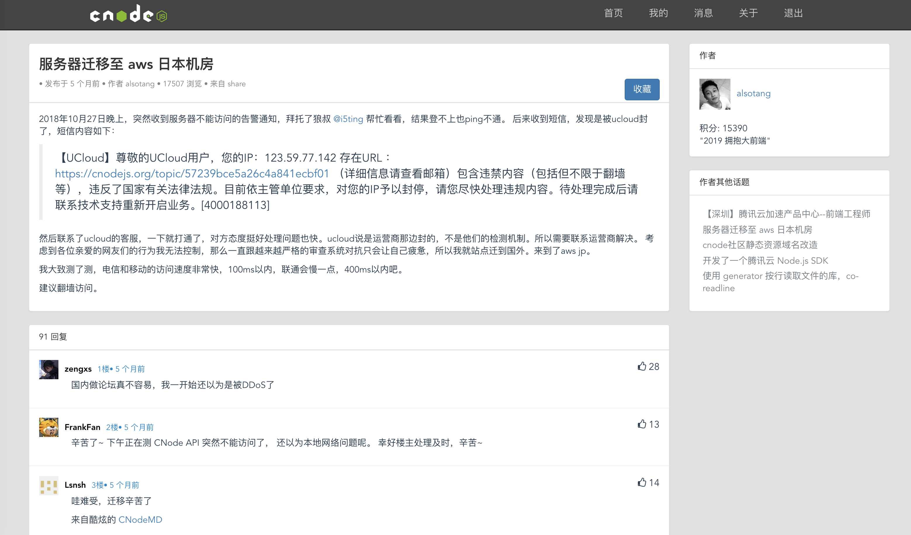

# vue-cnode-demo
Use of cnodejs.org API, based on vuejs rewrite.



## Installation
```
# clone the project
git clone git@github.com:Gasbylei/vue-cnode-demo.git

# install dependency
npm install

# develop
npm run serve
```
